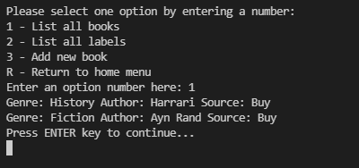

# My Catalog

This project is meant to be used to store your books and music albums information, with the additional feature that you can organize them by the label in the case of books and by genre in the case of music albums.

Take a look at neat and simple UI:

### Home menu

### Books menu

### Music menu

Enjoy it!

## 🧩 Built With

- Ruby.
- Linters.

## 🖥️ Install

- Install Ruby based on your OS from [HERE](https://www.ruby-lang.org/en/downloads/).

## 📚 Getting Started

1. Clone the project using git-bash or Githup Desktop.
2. Open the project folder with VSCode or any Editor.
3. In the project folder run `bundle install` on the terminal
4. To run the test run `rspec spec` on the terminal
5. To execute the program run `ruby main.rb`

## Authors

👤 **William Morales**

- GitHub: [@williamrolando88](https://github.com/williamrolando88)
- Twitter: [@WillyMorales93](https://twitter.com/WillyMorales93)
- LinkedIn: [William Morales](https://www.linkedin.com/in/william-rolando-morales/)

👤 **Yigit Mersin**

- GitHub: [@github](https://github.com/ygtmrsn)
- LinkedIn: [@linkedIn](linkedin.com/in/yigitmersin)
- Twitter: [@twitter](https://twitter.com/ygtmrsn)

## 🤝 Contributing

Contributions, issues, and feature requests are welcome!

Feel free to check the [issues page](../../issues).

## 👏 Show your support

Give a ⭐️ if you like this project!

## 📝 License

Copyright (c) 2022 Yigit Mersin, William Morales

Permission is hereby granted, free of charge, to any person obtaining a copy of this software and associated documentation files (the "Software"), to deal in the Software without restriction, including without limitation the rights to use, copy, modify, merge, publish, distribute, sublicense, and/or sell copies of the Software, and to permit persons to whom the Software is furnished to do so, subject to the following conditions:

The above copyright notice and this permission notice shall be included in all copies or substantial portions of the Software.

THE SOFTWARE IS PROVIDED "AS IS", WITHOUT WARRANTY OF ANY KIND, EXPRESS OR IMPLIED, INCLUDING BUT NOT LIMITED TO THE WARRANTIES OF MERCHANTABILITY, FITNESS FOR A PARTICULAR PURPOSE AND NONINFRINGEMENT. IN NO EVENT SHALL THE AUTHORS OR COPYRIGHT HOLDERS BE LIABLE FOR ANY CLAIM, DAMAGES OR OTHER LIABILITY, WHETHER IN AN ACTION OF CONTRACT, TORT OR OTHERWISE, ARISING FROM, OUT OF OR IN CONNECTION WITH THE SOFTWARE OR THE USE OR OTHER DEALINGS IN THE SOFTWARE.